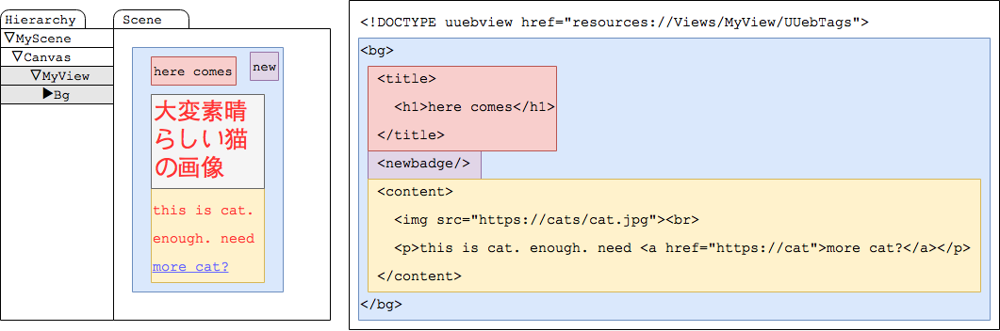

# Kill WebView

#### by 殺意駆動開発(@toru_inoue)
---

## 概要
Unityでゲーム作ってて一番ハァ〜ってなるの  
どのへん？

自分はWebViewを組み込まないといけないあたり。  
お知らせ画面とか、そのへん。

---

実機でないと動かなかったりするじゃん？  
Unityなのに。

	
HTMLとJSとCSSを使わないといけないじゃん？  
Unityなのに。

---

絶対使うのにプラグイン必須ってのが耐え難い。

そして遅い。

---

他にも色々とあるが、  
ついに「殺る気が溜まった」ので、できたよ！ 

---

**みるがいい！！**  

これが！！ WebViewを殺すモノだ！！

[UUebView-freeversion](https://github.com/sassembla/UUebView-freeversion)

---

## UUebView is 何
UnityのコンテンツをHTMLで書けるようにする奴。

---

* uGUIからHTMLタグを生成
* HTML記法でコンテンツを作ると、良い感じにViewを吐き出すやつ。

---

こいつによって、JSやCSSを書くことなく、  
**HTML**と**uGUI定義**によってGUIを作り出せる。  

そして自由な頻度でviewの内容を更新できる。

---
# デモ

---

# 作り方紹介
## 1.適当にuGUIで雛形を作る

---

これらは次のような感じのパーツ名にしておく。

---

## 2.Window > UUebView > Generate UUeb Tags From Selection する

Hierarchy上で選択した項目が**HTMLタグ**になる。

---

## 3.内容となるHTMLファイルを用意する

こんな感じのやつ。

	
---

すると、良い感じに、uGUI定義のパーツが、  
htmlの通りに伸びたり縮んだりしたUIが生成される。

	
---

背景に色がついてるとこは、色的に対応する  
uGUIのパーツを使って生成される。

---

文字の位置や形状が、uGUIの束縛設定に従う。

---

# 仕様
**・レイアウトはuGUIで生成した雛形に準じる**  

縦に伸びたりコンテンツの横に置かれたりとかはすべてuGUIで設定される感じになる。

---
**・HTMLのように、同じタグを複数使うことで表示する項目数が増やせる**  

何を当たり前のことを、っていう感じだけど、  

良い感じに項目のレイアウトをした上で  
表示コンテンツを増やすことができる。

---

レイアウトを気にせず、コードを書かずに  
コンテンツを自由自在に増やせるのだ  
フハハハハハハ

---
**・uGUI経由でフォント指定したり  
画像指定できる**  

こういうのWebComponentsでもJS+CSSとかで  
できるけどUnity内ならぶっちゃけこれでよくね？

---

**・a、imgとか、基本的なタグは組み込み**  

もちろん新規追加もできる。  
君だけの最強のry

---

**・イベント機構あり**  

画像に対して「これはボタン」という設定を  
したり、要素にidを振ることが可能。

---

もちろんリンクを触ったら別のページを  
ロードしたりとかね。

あとスクリプトつけて自前でなんでもできる。  
回転するパーツとか光ったり云々とかね。

---

**・勿論htmlをサーバからDLするように書けば、、  
あとはわかるな？**  

そう、これはWebViewなのだ。

---

## 利点
* 軽量
* プラットフォームを選ばない
* 端末差なし
* JS、CSSが書けないのでそれらの知識がいらない
* C#のevalがそもそも動かない環境が多いのでExploitがない、というかできない
* OSバージョンアップで壊れたりしない
* 好きなタイミングでタグを更新したり追加したりできる
(説明してないけどできる。)

---

## 欠点
* 動的にコードを足すことができない

iOS等の制約を超えるものはできないんだけど  
これはまあ従来のものでもできない。

---

## 予定

HTMLタグ生成をもうちょっと便利にしたり  
TagsをAssetBundleからDLしたり、  
movieタグとかを組み込んだバージョンを商用で作り中。  

---

あと汎用アニメーションはUnityのデフォルトの  
もので解決できるかどうかを試験中。  

たぶんできる。  

できたらアニメーションはだいたいどうにかなる。

---

現在リポジトリからDLできるものは、  
商用がリリースされてもそのまま無償で使える  
フリー版にするつもり。

(使用知見が足りなすぎる)

---

# やったぜ
