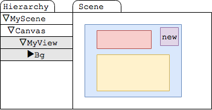
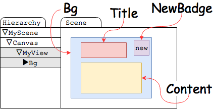
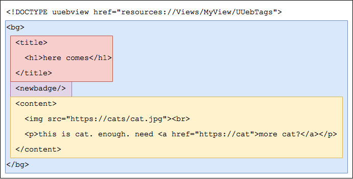
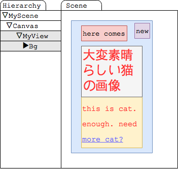

# Kill WebView

## 概要
Unityでゲーム作ってて一番アンニュイになるところってどのへん？

自分はWebViewを組み込まないといけないあたり。
お知らせ画面とか、そのへん。

---

## 概要
実機でないと動かなかったりするじゃん？
Unityなのに。
	
HTMLとJSとCSSを使わないといけないじゃん？
Unityなのに。

---

## 概要
あんだけ沢山使うのにネイティブプラグイン必須っていうのが耐えられない。

遅い。

---

## 概要
他にも色々とあるが、ということで「殺る気が溜まった」ので、できたよ！ 

**みるがいい！！**
これが！！ WebViewを殺すモノだ！！

[UUebView-freeversion](https://github.com/sassembla/UUebView-freeversion)

---

## UUebView is 何
UnityのコンテンツをHTMLで書けるようにする奴。
より具体的に言うと、

* uGUIからHTMLタグを生成
* HTML記法でコンテンツを作ると、良い感じにViewを吐き出すやつ。

---

## UUebView is 何
こいつによって、JSやCSSを書くことなく、HTMLとuGUIパーツによってGUIを作り出すことができるようになる。
そして自由な頻度でviewの内容を更新することができる。

---

# Viewの作り方を紹介するぜ！！！

## 1.適当にuGUIで雛形を作る

これらは次のような感じのパーツ名にしておく。

2.Window > UUebView > Generate UUeb Tags From Selection する

Hierarchy上で選択した項目がHTMLタグになる。

3.HTMLファイルを用意する

こんな感じのやつ。

	

すると、良い感じにuGUIの中身がhtmlで書いた内容の通りに伸びたり縮んだりしてUIを生成する。

	

テキスト背景に色がついてるとこは、そのまま色的に対応するuGUIのパーツを使って生成される。

中に入る文字の位置や形状が、uGUIの状態に従う。

これは表示の有無も例外ではなくて、
例えばnewbadge要素とかは、書けばnewのアイコンが出るし、書かなければアイコンが出ない。

## 仕様
**・レイアウトはuGUIで生成した雛形に準じる**  
縦に伸びたりコンテンツの横に置かれたりとかはすべてuGUIで設定される感じになる。
	
**・HTMLのように、同じタグを複数使うことで表示する項目数が増やせる**  
何を当たり前のことを、っていう感じだけど、良い感じに項目のレイアウトをした上でコンテンツを増やすことができる。

レイアウトのことを気にせず、コードを書かずにコンテンツを自由自在に増やせるのだフハハハハハハ

**・uGUI経由で、自作タグに独自でフォント指定したり画像指定したりすることができる**  

こういうのWebComponentsでもJS+CSSとかでできるけどUnity内ならぶっちゃけこれでよくね？

**・aとかimgとか、基本的なタグは組み込みで用意されているし、自作することもできる**  

できる。君だけのry

**・イベント機構あり**  

画像に対して「これはボタンだ」という設定をしたり、すべての要素にidを振り、クリックイベントなどを取ることが可能。

もちろんリンクを触ったら別のページロードしたりとかね。

あとスクリプトつけて自前でなんでもできる。回転するパーツとか光ったり云々とかね。

**・もちろんhtmlをサーバからDLするように書けば、、あとはわかるな？**  

そう、これはWebViewなのだ。

## 利点
* 軽量
* プラットフォームを選ばない
* 端末差なし
* JS、CSSが書けないのでそれらの知識がいらない
* C#のevalがそもそも動かない環境が多いのでExploitがない、というかできない
* 必要なHTMLの知識が少ない
* OSバージョンアップで壊れたりしない
* 好きなタイミングでタグを更新したり追加したりできる
説明してないけどできる。

## 欠点
* 動的にコードを足すことができない

iOS等の制約を超えるものはできないんだけどこれはまあ従来のものでもできない。

## 予定

HTMLタグ生成をもうちょっと便利にしたりTagsをAssetBundleからDLしたり、movieタグとかを組み込んだバージョンを商用で作り中。  

あと汎用アニメーションはUnityのデフォルトのもので解決できるかどうかを試験中。それがあるとアニメーションはだいたいどうにかなる。

現在リポジトリからDLできるものは、商用になっても無償で使えるフリー版。

商用がリリースされてもそのまま使えるようにするつもり。

